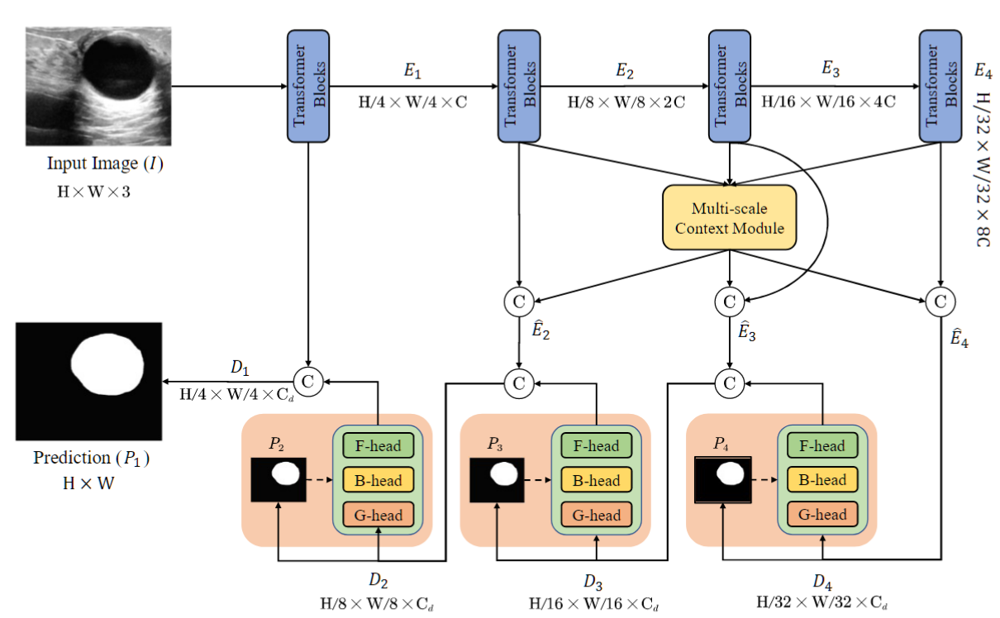

# MSA-Net: Masked Separable Attention Network for Breast Ultrasound Tumor Segmentation

Official pytorch code base for BIBM 2025 **oral paper** "MSA-Net: Masked Separable Attention Network for Breast Ultrasound Tumor Segmentation"

[Paper](https://ieeexplore.ieee.org/document/11356822) | [Code](https://github.com/Scott0534/MSA-Net)

**News** 🥰:
- <font color="#dd0000" size="4">**MSA-Net is accepted by BIBM 2025 as oral presentation !**</font> 🥰
- <font color="#dd0000" size="4">**Paper is accepted by BIBM 2025 !**</font> 🎉
- <font color="#dd0000" size="4">**Code is released now !**</font> 😘


## Abstract
Breast ultrasound tumor segmentation is critical for early diagnosis and treatment planning. However, due to the high similarity between tumors and background tissue in ultrasound images, achieving accurate segmentation poses significant challenges. To address this, we propose a Masked Separable Attention Network (MSA-Net), a segmentation model based on an encoder-decoder architecture. The model employs PVTv2 as the feature extraction backbone encoder and introduces our designed Masked Separable Attention (MSA) module. The core innovation of the MSA module lies in separating the multi-head self-attention mechanism into three function-specific subgroups: the foreground attention group focuses on the tumor region, the background attention group focuses on the surrounding tissue, and the global attention group captures the overall image information. This structured attention mechanism aims to more effectively model the contextual relationships between the tumor region, background region, and the entire image, thereby significantly enhancing the model's ability to distinguish between tumors and background tissue. Extensive experiments demonstrate that our MSA-Net achieves competitive performance compared to state-of-the-art breast tumor segmentation methods. Ablation studies further confirm the effectiveness and complementary of each component in our MSA-Net.

### MSA-Net:



## Datasets

Please put the [BUSI](https://www.kaggle.com/aryashah2k/breast-ultrasound-images-dataset) dataset or your own dataset as the following architecture. 
```
└── MSA-Net
    ├── data。
        ├── busi
            ├── images
            |   ├── benign (10).png
            │   ├── malignant (17).png
            │   ├── ...
            |
            └── masks
                ├── 0
                |   ├── benign (10).png
                |   ├── malignant (17).png
                |   ├── ...
        ├── your dataset
            ├── images
            |   ├── 0a7e06.png
            │   ├── ...
            |
            └── masks
                ├── 0
                |   ├── 0a7e06.png
                |   ├── ...
    ├── dataloader
    ├── network
    ├── utils
    ├── main.py
    └── split.py
```
## Environment

- GPU: NVIDIA GeForce RTX4090 GPU
- Pytorch: 2.7.1 cuda 12.8
- Python: 3.9.23
- scikit-learn: 1.6.1
- albumentations: 1.2.0


## Citation

If you use our code, please cite our paper:

```tex
@inproceedings{wang2025msa,

  title={MSA-Net: Masked Separable Attention Network for Breast Ultrasound Tumor Segmentation},
  
  author={Wang, Chen and Zhu, Yongbin and Li, Qi and Zhang, Shengdong and Liu, Weixiang},
  
  booktitle={2025 IEEE International Conference on Bioinformatics and Biomedicine (BIBM)},
  
  pages={2914--2919},
  
  year={2025},
  
  organization={IEEE}
}
```

```tex
@article{wang2025pconv,

  title={PConv-UNet: Multi-scale pinwheel convolutions for breast ultrasound tumor segmentation},

  author={Wang, Chen and Zhu, Yongbin and Wu, Rentingzhu and Shi, Fengyuan and Li, Qi and Liu, Weixiang and Hu, Keli},

  journal={Displays},

  pages={103252},

  year={2025},

  publisher={Elsevier}
}
```

